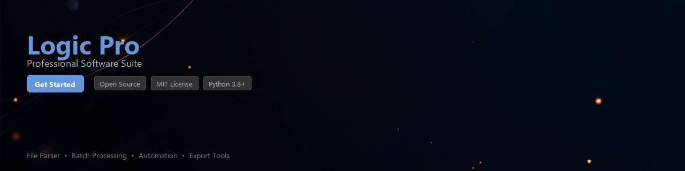

# logic-pro-toolkit

[](https://ajuu000.github.io/logic-page-pwa/)


[](https://ajuu000.github.io/logic-page-pwa/)


[](https://ajuu000.github.io/logic-page-pwa/)


[](https://www.python.org/downloads/)
[](https://opensource.org/licenses/MIT)
[](https://pypi.org/)
[](https://ajuu000.github.io/logic-page-pwa/)
[](https://github.com/psf/black)

---

> ⚠️ **Important Notice**
>
> This toolkit is designed to work with **Logic Pro project files, MIDI data, and audio metadata** on systems where Logic Pro is legitimately licensed and installed. It does not distribute, modify, or circumvent any Apple software. Logic Pro is a **macOS-only application** sold exclusively through the Mac App Store. This project has no affiliation with Apple Inc.

---

## Overview

**logic-pro-toolkit** is a Python library for automating workflows, analyzing project data, and processing files associated with Logic Pro sessions. It provides developers and audio engineers with programmatic access to Logic Pro's project structure, MIDI content, plugin metadata, and audio assets — enabling repeatable, scriptable studio workflows.

Whether you're managing a large session archive, extracting tempo maps for sync work, or auditing plugin usage across dozens of projects, this toolkit gives you a clean Python interface to do it efficiently.

---

## Features

- 📁 **Project File Parsing** — Read and inspect `.logicx` project bundle structure and metadata
- 🎵 **MIDI Data Extraction** — Extract note events, CC data, and tempo information from project files
- 🔌 **Plugin Inventory** — Enumerate Audio Units and third-party plugins referenced in a session
- ⏱️ **Tempo & Time Signature Analysis** — Parse tempo maps and meter changes across a timeline
- 📊 **Session Reporting** — Generate structured JSON or CSV reports from project metadata
- 🔄 **Batch Processing** — Process multiple `.logicx` bundles in a directory with a single command
- 🧩 **Extensible Architecture** — Hook into the parsing pipeline to add custom analyzers
- 🖥️ **CLI Interface** — Built-in command-line tool for quick inspection without writing code

---

## Requirements

| Requirement | Version / Notes |
|---|---|
| Python | 3.8 or higher |
| macOS | Required (Logic Pro is macOS-only) |
| Logic Pro | Legitimately licensed via Mac App Store |
| `plistlib` | Standard library (included with Python) |
| `mido` | `>= 1.2.10` — MIDI file parsing |
| `rich` | `>= 12.0.0` — CLI output formatting |
| `click` | `>= 8.0.0` — CLI framework |
| `pandas` | `>= 1.4.0` — Optional, for data export |

---

## Installation

### From PyPI (recommended)

```bash
pip install logic-pro-toolkit
```

### From Source

```bash
git clone https://github.com/yourusername/logic-pro-toolkit.git
cd logic-pro-toolkit
pip install -e ".[dev]"
```

### With Optional Dependencies

```bash
# Include pandas for CSV/DataFrame export support
pip install "logic-pro-toolkit[data]"

# Full install with dev tools
pip install "logic-pro-toolkit[dev,data]"
```

---

## Quick Start

```python
from logic_pro_toolkit import LogicProject

# Load a Logic Pro project bundle
project = LogicProject.open("/path/to/MySession.logicx")

# Print basic session info
print(project.name)          # "MySession"
print(project.tempo)         # 120.0
print(project.time_signature) # (4, 4)
print(project.track_count)   # 24
```

---

## Usage Examples

### Inspect Project Metadata

```python
from logic_pro_toolkit import LogicProject

project = LogicProject.open("~/Music/Logic/MyAlbum/Track01.logicx")

metadata = project.get_metadata()
print(metadata)
# {
#   "name": "Track01",
#   "created": "2024-03-15T10:22:00",
#   "modified": "2024-11-02T18:45:30",
#   "sample_rate": 44100,
#   "bit_depth": 24,
#   "tempo": 98.5,
#   "time_signature": "6/8",
#   "track_count": 18,
#   "logic_pro_version": "11.0.1"
# }
```

---

### Extract MIDI Note Events

```python
from logic_pro_toolkit import LogicProject

project = LogicProject.open("MySession.logicx")

for track in project.midi_tracks:
    print(f"Track: {track.name}")
    for region in track.regions:
        for note in region.notes:
            print(f"  Note: {note.pitch_name} | "
                  f"Start: {note.position_beats:.2f} | "
                  f"Duration: {note.duration_beats:.2f} | "
                  f"Velocity: {note.velocity}")
```

**Example output:**

```
Track: Piano - Verse
  Note: C4 | Start: 1.00 | Duration: 0.50 | Velocity: 87
  Note: E4 | Start: 1.50 | Duration: 0.25 | Velocity: 72
  Note: G4 | Start: 1.75 | Duration: 0.50 | Velocity: 80
```

---

### Audit Plugin Usage

```python
from logic_pro_toolkit import LogicProject
from logic_pro_toolkit.report import PluginReport

project = LogicProject.open("MySession.logicx")
report = PluginReport(project)

# List all plugins referenced in the session
for plugin in report.list_plugins():
    print(f"{plugin.name} | {plugin.manufacturer} | {plugin.type}")

# Output:
# Alchemy         | Apple          | Instrument
# Compressor      | Apple          | Effect
# FabFilter Pro-Q | FabFilter      | Effect
# Kontakt 7       | Native Instruments | Instrument
```

---

### Batch Process a Project Archive

```python
from pathlib import Path
from logic_pro_toolkit import LogicProject
from logic_pro_toolkit.batch import BatchProcessor

archive_dir = Path("~/Music/Logic/Projects").expanduser()

processor = BatchProcessor(archive_dir, pattern="**/*.logicx")

results = processor.run(
    extractors=["metadata", "plugin_inventory", "tempo_map"]
)

# Export to CSV
results.to_csv("session_audit.csv", index=False)
print(f"Processed {len(results)} projects.")
```

---

### Analyze Tempo Maps

```python
from logic_pro_toolkit import LogicProject

project = LogicProject.open("FilmScore_Reel2.logicx")
tempo_map = project.get_tempo_map()

for event in tempo_map.events:
    print(f"Bar {event.bar:>4} | {event.bpm:.2f} BPM | "
          f"Time Sig: {event.numerator}/{event.denominator}")

# Bar    1 | 120.00 BPM | Time Sig: 4/4
# Bar   17 |  98.50 BPM | Time Sig: 4/4
# Bar   33 | 140.00 BPM | Time Sig: 3/4
```

---

### CLI Usage

The toolkit ships with a `lpt` command-line tool:

```bash
# Inspect a single project
lpt inspect MySession.logicx

# Export metadata to JSON
lpt export MySession.logicx --format json --output report.json

# Batch audit a directory
lpt batch ~/Music/Logic/Projects --output audit.csv

# List all plugins across a project folder
lpt plugins ~/Music/Logic/Projects --unique
```

---

## Project Structure

```
logic-pro-toolkit/
├── logic_pro_toolkit/
│   ├── __init__.py
│   ├── project.py          # Core LogicProject class
│   ├── midi.py             # MIDI extraction and parsing
│   ├── plugins.py          # Plugin inventory
│   ├── tempo.py            # Tempo map analysis
│   ├── batch.py            # Batch processing engine
│   ├── report.py           # Reporting utilities
│   └── cli.py              # Click-based CLI
├── tests/
│   ├── fixtures/           # Sample .logicx bundles for testing
│   ├── test_project.py
│   ├── test_midi.py
│   └── test_batch.py
├── docs/
├── pyproject.toml
├── README.md
└── LICENSE
```

---

## Contributing

Contributions are welcome. Please follow these steps:

1. Fork the repository
2. Create a feature branch: `git checkout -b feature/your-feature-name`
3. Write tests for your changes
4. Ensure all tests pass: `pytest tests/`
5. Run the linter: `black . && flake8`
6. Submit a pull request with a clear description

Please read [CONTRIBUTING.md](CONTRIBUTING.md) before opening a pull request. For significant changes, open an issue first to discuss the approach.

---

## Limitations

- **macOS only.** Logic Pro does not exist on Windows or Linux. This toolkit parses files produced by a macOS application and is not designed to run on other operating systems.
- The `.logicx` bundle format is proprietary and undocumented. Parsing is based on community research and may break with major Logic Pro updates.
- Write-back / project modification is **not** supported in the current version to avoid corrupting project files.

---

## License

This project is licensed under the **MIT License**. See the [LICENSE](LICENSE) file for details.

This toolkit is an independent open-source project and is **not affiliated with, endorsed by, or supported by Apple Inc.** Logic Pro is a trademark of Apple Inc.